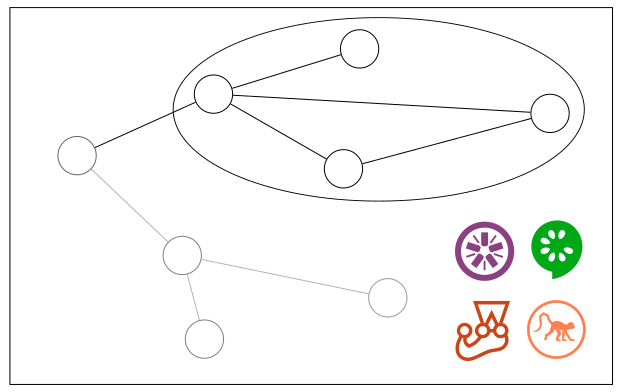

class: center, middle

# Fail fast and succeed!
Test-Driven JavaScript Application Development



Daniel Maslowski |  @orangecms |  orangecms

---

# ToC

1. Introduction
2. Low-level: Assert
3. Medium-level: Jasmine
4. Medium-level: Jest
5. High-level: Cucumber
6. High-level: Chimp

---

class: center, middle
# 1. Introduction

---

## Why should I write tests?

- proof that software works (as specified)
- regression mitigation: makes later changes easier
- design flaw detection: tests outline API/UI usage

--

## What should I write tests for?

- libraries: do methods return desired output in given input?
- components: do they receive and handle input correctly?
- applications: do routes, form submissions etc work? 

---

## What should tests cover?

- rule of thumb: look at your software's purpose
  - imagine your flow chart and find crucial paths
  - identify essential operations like transformations
- the more, the better :)
- when you find a bug, write a test to avoid it later

---

## Terminology

- SUT: system under test
- suite/feature: a portion of the test
  - setup: shortcut to the initial state of a case
  - case/step: unit of a suite/feature
  - teardown: cleanup, reset to initial state of the SUT
- assertion/expectation: statement in a step making it fail or pass

---

## Relation to control flow chart

- suite/feature: connected subgraph of the SUT
- case/step: a state transition (edge in graph)


---

## Test Doubles

- test double: object for simulation (partially) implementing an API
  - dummy: test double returning nothing
  - stub: test double returning canned replies
  - fake: test double taking shortcuts, close to its real counterpart
  - mock: test double with assertions but no real output
- spy: a wrapper to help with assertions on input to a mock or stub

http://www.martinfowler.com/bliki/TestDouble.html
https://adamcod.es/2014/05/15/test-doubles-mock-vs-stub.html

---

## Test runners

- provide a CLI
- run the tests/suites you define
- print out a report
- allow for CI/CD 😺

--


- Karma, Jasmine, Cucumber, Chimp, Velocity, ...

---

## Frameworks and Libraries

- Assert

--


- Cucumber

--


- Jasmine

--


- Mocha
- Chai
- Sinon

--


- Jest
- Enzyme

--


- tape
- AVA

---

## Browser testing

- many ways to use Selenium
  - selenium-webdriver
  - chromedriver
  - webdriverjs
  - WebdriverIO
  - Chimp

--


- PhantomJS
- CasperJS
- SlimerJS
- Karma
- Cypress

---

class: center, middle
# 2. Low-level: Assert 

---

## Assert API

```JavaScript
// import assert core library
const assert = require('assert');
```
--
```JavaScript
// try a very simple test
let foo = true;
```
--
```JavaScript
// okay let's check for equality
assert.equal(foo, true);
```
--
```JavaScript
// and the negation
assert.notEqual(foo, false);
```
--
```JavaScript
// sadly, it only checks with "==" :(
assert.equal(foo, 1);
```
--
```JavaScript
// we can check for exceptions though...
const bar = () => { throw new Error("kaboom"); };
assert.throws(bar);
```

---

## Assert API

```JavaScript
> assert
{ [Function: ok]
  AssertionError: 
   { [Function: AssertionError]
     super_: 
      { [Function: Error]
        captureStackTrace: [Function: captureStackTrace],
        stackTraceLimit: 10 } },
  fail: [Function: fail],
  ok: [Circular],
  equal: [Function: equal],
  notEqual: [Function: notEqual],
  deepEqual: [Function: deepEqual],
  deepStrictEqual: [Function: deepStrictEqual],
  notDeepEqual: [Function: notDeepEqual],
  notDeepStrictEqual: [Function: notDeepStrictEqual],
  strictEqual: [Function: strictEqual],
  notStrictEqual: [Function: notStrictEqual],
  throws: [Function],
  doesNotThrow: [Function],
  ifError: [Function] }
```

---

class: center, middle
# 3. Medium-level: Jasmine


---

## Jasmine outline

- useful for unit testing
- descriptive test suites and cases
- documentation consists of test suites by itself
- support for asynchronous functions
- spies to watch method calls and parameters
- many plugins available
- extensible with custom matchers
- can be used in many contexts
- run from Node, Ruby, and Python

---

class: center, middle
## DEMO 🐢

---

class: center, middle
# 4. Medium-level: Jest


---

## Jest

- painless JavaScript unit testing
- uses Jasmine assertions
- parallel and sandboxed
- automatically mocks modules

--


- DEMO?

---

class: center, middle
# 5. High-level: Cucumber


---

## Cucumber outline

- DSL: Gherkin, outlines specs
- provides test stubs for you
- implemented for many languages
- browser testing is very hard to set up
  - and sadly not well documented :(

--


- I got it working with WebdriverIO!

--


- DEMO?

---

class: center, middle
# 6. High-level: Chimp


---

## Chimp

- promises simplicity like Velocity
- documentation is still in progress
- best practice tutorial is highly complicated
- installation takes a looong time
- running the first time downloads a local copy of selenium
- does not work on FreeBSD (bad in case it's your CI server)

--


- sets up Cucumber and Jasmine for you

--


- DEMO?

---

class: center, middle
# Thanks, that's it! 😸
